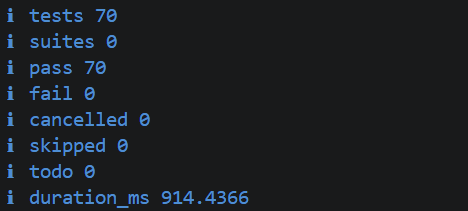

# Lyx Passport

Lyx Passport är ett REST-API som använder blockkedjeteknik för att registrera transaktioner relaterade till lyxprodukter, såsom smycken och sällsynta samlarobjekt. Varje produkt tilldelas en unik digital identitet, där transaktioner såsom registrering och överföring valideras och samlas. Efter validering minas transaktionerna till block med hjälp av Proof-of-Work-algoritmen.

Projektet är en blockkedjeimplementering med en enda nod och är inte avsett att vara en blockkedjeapplikation av produktionskvalitet. Projektet bygger på följande koncept:

* REST API med Express endpoints för interaktion med blockkedjan
* Proof-of-Work (PoW) med konfigurerbar difficulty
* State- och transaction validation
* MVC-style architecture samt unit- och integration tests

## Problem

Lyx Passport löser problemet genom att registrera följande events:

* **Registrering av produkten:** Skapar ett digitalt pass för en produkt som tilldelas sin första ägare.
* **Ägarbyte:** Registrerar ett ägarbyte när en produkt överförs från en ägare till en annan.

Workflowet ser ut enligt följande:

```text
Produktregistrering
        ↓
Transaction validation
        ↓
Transaktionen läggs till i pending pool
        ↓
Mining
        ↓
Nytt block läggs till i blockkedjan
        ↓
Produkt- och ägarverifiering
        ↓
Transfer of ownership
        ↓
Ny cykel av transaction validation och mining
```

## Tekniker som används

* Express 5
* Node.js
* Node.js `crypto`
* Node.js test runner
* JavaScript ES modules
* SHA-256

## Arkitektur

Applikationen har en skiktad MVC-liknande arkitektur.

| Lager                 | Ansvar                                                                                                                    |
| --------------------- | ------------------------------------------------------------------------------------------------------------------------- |
| **Routes**            | För mappning av URL:er och HTTP-metoder till controller-funktioner.                                                       |
| **Controllers**       | För att ta emot HTTP-requests, skicka responses till klienten och anropa blockchain-funktioner.                           |
| **Service**           | För att skapa och tillgängliggöra blockchain-instanser.                                                                   |
| **Blockchain engine** | För att validera och hantera pending transactions, mina block och kontrollera blockkedjans giltighet.                     |
| **Middleware**        | För att konvertera errors till HTTP-responses och hantera okända routes.                                                  |
| **Errors**            | För att definiera errors, såsom obehöriga transfers.                                                                      |
| **Utils**             | För rekursiv freezing och serialization.                                                                                  |
| **Configuration**     | För att parsa och validera environment variables, såsom PoW difficulty.                                                   |
| **Tests**             | För att verifiera funktionaliteten hos enskilda moduler och säkerställa att det övergripande workflowet fungerar korrekt. |

### Projektstruktur

```text
lyx-passport/
├── docs/
│   └── images/
│       └── test_3.png
├── src/
│   ├── config/
│   │   └── config.js
│   ├── controllers/
│   │   └── blockchainController.js
│   ├── engine/
│   │   ├── Block.js
│   │   └── Blockchain.js
│   ├── errors/
│   │   └── AppError.js
│   ├── middleware/
│   │   ├── errorHandler.js
│   │   └── notFound.js
│   ├── routes/
│   │   └── blockchainRoutes.js
│   ├── services/
│   │   └── blockchainService.js
│   ├── utils/
│   │   ├── deepFreeze.js
│   │   └── stableStringify.js
│   ├── app.js
│   └── server.js
├── test/
│   ├── api.test.js
│   ├── appError.test.js
│   ├── block.test.js
│   ├── blockchain.test.js
│   ├── blockchainService.test.js
│   ├── deepFreeze.test.js
│   ├── errorHandler.test.js
│   ├── health.test.js
│   ├── stableStringify.test.js
│   ├── stateValidation.test.js
│   └── transactions.test.js
├── .env.example
├── .gitignore
├── package.json
├── package-lock.json
└── README.md
```

## Kör och testa applikationen

### Krav

* Node.js 18 eller en nyare version
* npm

### Klona repo:t

```bash
git clone https://github.com/vishnuprasadpendyala/lyx-passport.git
cd lyx-passport
```

Installera beroenden enligt `package-lock.json`:

```bash
npm ci
```

Alternativt:

```bash
npm install
```

### Skapa en lokal miljöfil

Skapa en lokal miljöfil som innehåller:

```env
PORT=3000
POW_DIFFICULTY=1
```

I PowerShell kan `.env` skapas från `.env.example` med:

```powershell
Copy-Item .env.example .env
```

### Starta applikationen

Starta applikationen i utvecklarläge:

```bash
npm run dev
```

Eller starta den i standardläge:

```bash
npm start
```

API:et körs på:

```text
http://localhost:3000
```

### Kör testerna

```bash
npm test
```

Projektet inkluderar både unit- och integrationstester som tillsammans verifierar att olika komponenter fungerar korrekt, både individuellt och tillsammans.

Unit-testerna verifierar:

* `block.test.js` — skapande av block, SHA-256-hashar, nonce och mining
* `blockchain.test.js` — genesis block, blocklänkning, freezing och kedjevaliditet
* `transactions.test.js` — pending transactions, mining, ägarstatus och historik
* `stateValidation.test.js` — payload- och ägarregler
* `stableStringify.test.js` — deterministisk serialization
* `deepFreeze.test.js` — rekursiv freezing
* `appError.test.js` — custom application errors
* `blockchainService.test.js` — blockchain-instans
* `errorHandler.test.js` — error handling i middleware

Integrationstesterna verifierar:

* `api.test.js` — workflow för registrering, mining, överföring och verifiering
* `health.test.js` — API:ets health response



## API Endpoints

| Method | Endpoint            | Beskrivning                                                            |
| ------ | ------------------- | ---------------------------------------------------------------------- |
| `GET`  | `/health`           | För att kontrollera serverns status                                    |
| `GET`  | `/api/chain`        | För att returnera pending transactions och ledger                      |
| `POST` | `/api/transactions` | För att validera transactions                                          |
| `POST` | `/api/mine`         | För att mina pending transactions                                      |
| `GET`  | `/api/verify/:id`   | För att hämta produktens nuvarande ägare och mined transaction history |

## HTTP Status Codes

|                      Status | Betydelse                                      |
| --------------------------: | ---------------------------------------------- |
|                    `200 OK` | Request genomförd                              |
|               `201 Created` | Accepterad transaction eller mined block       |
|           `400 Bad Request` | Felaktig transaction payload                   |
|             `404 Not Found` | Produkten existerar inte                       |
|  `422 Unprocessable Entity` | Tom mining pool eller ogiltig state transition |
| `500 Internal Server Error` | Internt serverfel                              |

## Vad som kan förbättras

För närvarande fungerar applikationen som en enda nod utan distribuerad konsensus, persistent extern lagring eller peer-to-peer-kommunikation. Blockkedjan lagras i minnet och återställs därför när servern startas om.

Möjliga framtida förbättringar är permanent lagring av blockkedjan i en extern databas samt digitala signaturer för att säkerställa att ägarbyten endast kan godkännas av de faktiska ägarna.

## Utvecklad av

[Vishnu](https://github.com/vishnuprasadpendyala)